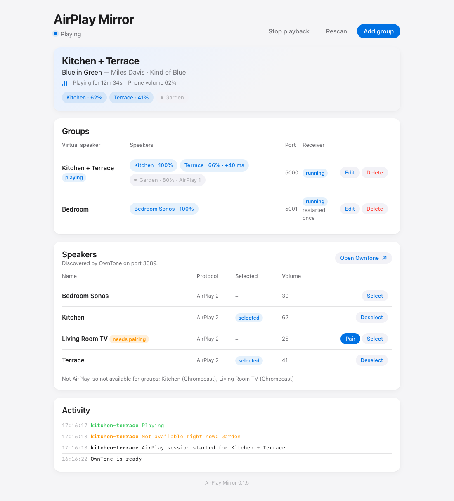

# AirPlay Mirror

[](https://github.com/parallax/airplay-mirror/actions/workflows/build.yml)

A Home Assistant add-on that advertises **groups of AirPlay speakers as single virtual AirPlay speakers**. Define "Kitchen + Terrace" once, pick it from AirPlay on your phone like any other speaker, and the audio is relayed, in sync, to every speaker in the group.

It exists because AirPlay discovery from a phone on WiFi to speakers on WiFi is flaky, and because AirPlay 1 senders (and plenty of apps) can't do multi-room at all. The add-on runs on the Home Assistant box on the wired network, so the only thing your phone has to find is the one machine with a rock-solid Bonjour presence.

- Any number of named groups, each advertised as its own AirPlay speaker
- Audio is re-sent to the real speakers **over AirPlay 2** (with AirPlay 1 as a per-speaker fallback), so they stay in sync
- Speakers are pinned in the sender's list so their own patchy Bonjour adverts don't matter
- Per-speaker volume levels within a group; the phone's volume slider still works on top
- Apple TV pairing, status, and a log in the Home Assistant sidebar
- Everything persists in `/data`; groups can be edited live without restarting the add-on



## How it works

```
iPhone ──AirPlay──▶ shairport-sync "Kitchen + Terrace"  ─┐
                    shairport-sync "Bedroom Zone"        ─┤ named pipes
                                                          ▼
                                            OwnTone ──AirPlay 2──▶ Kitchen, Terrace, ...
```

One [shairport-sync](https://github.com/mikebrady/shairport-sync) receiver per group accepts the stream and writes PCM to a named pipe. [OwnTone](https://owntone.github.io/owntone-server/) watches the pipes and plays whatever arrives to the speakers the controller selected for that group. A small Python controller generates the configs, supervises the processes, switches speakers when a session starts and serves the UI.

## Install in Home Assistant

1. **Settings → Add-ons → Add-on store → ⋮ → Repositories**, add `https://github.com/parallax/airplay-mirror`.
2. Install **AirPlay Mirror** and start it. It needs host networking (set in the add-on manifest) so Bonjour and AirPlay work.
3. Open it from the sidebar. The *Speakers* list fills as OwnTone discovers your AirPlay devices. Pair any Apple TV (it shows a PIN).
4. **Add group**, give it a name, tick the speakers, set their levels. Within a few seconds the name appears in AirPlay on your phone.

See [airplay_mirror/DOCS.md](airplay_mirror/DOCS.md) for options, the AirPlay 2 caveats (HomeKit permissions, PTP ports) and troubleshooting.

## Run standalone

```bash
docker run -d --name airplay-mirror --net host -v airplay-mirror:/data ghcr.io/parallax/airplay-mirror:latest
```

Host networking is mandatory. The UI is on port 8099 with no authentication. See [docker-compose.yml](docker-compose.yml).

## Development

```bash
cd airplay_mirror
python -m venv .venv && . .venv/bin/activate
pip install -e ".[dev]"
pytest
ruff check .
AM_SUPERVISE=false AM_DATA_DIR=./dev-data python -m airplay_mirror   # UI + config generation, no audio processes
```

`engine.py` is a pure state machine (sessions, takeover, late-joining speakers, playback fallback) covered by unit tests. `runner.py` wires it to OwnTone's JSON API and the process supervisor, `templates.py` renders the config files, `web.py` serves the UI.

Releases: bump `version` in `airplay_mirror/config.yaml` and `pyproject.toml`, add a changelog entry, push to `main`. The workflow builds a multi-arch image and pushes it to `ghcr.io/parallax/airplay-mirror`.

## Credits

Built on [shairport-sync](https://github.com/mikebrady/shairport-sync) by Mike Brady and [OwnTone](https://github.com/owntone/owntone-server). The "pipe into OwnTone" trick is documented by both projects; this add-on just packages it and adds the group plumbing.

## License

MIT
